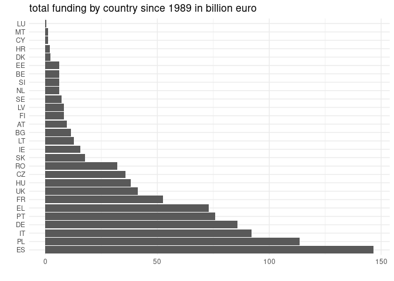
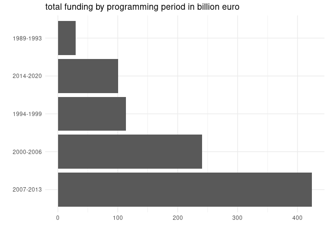
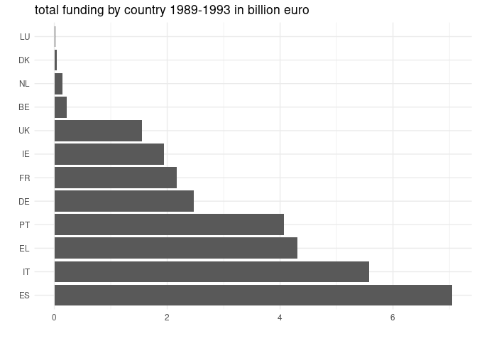
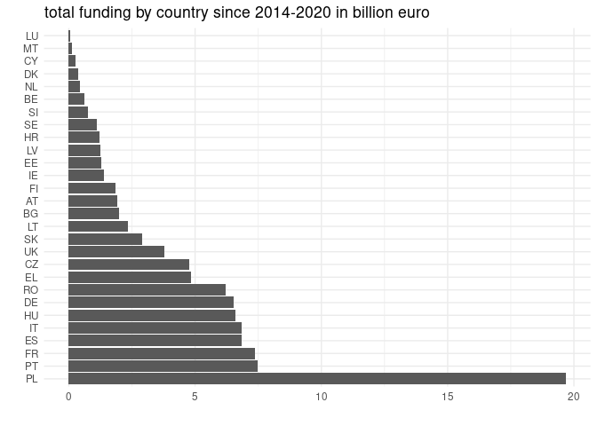

## EU Funding Data Collection & Visualization

This project aims at collecting and visualizing European Union fiscal transfers data. We use the API provided by the European Commission to collect up to date information about fiscal transfers towards European regions in the context of the European Budget. The units of observation correspond to level 2 of the NUTS classification (Nomenclature of territorial units for statistics), which is the hierarchical system for dividing up the territory of the EU for the purpose of data collection. Fiscal transfers are reported on the NUTS2 level, which is also the relevant level for fund distribution under many budget items.

